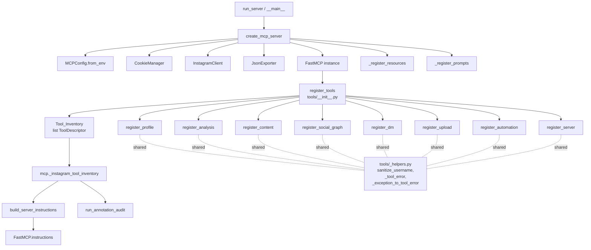
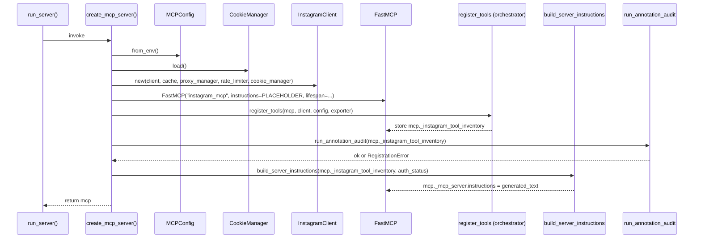

# Design Document

## Overview

`mcp-architecture-hardening` feature `instagram-mcp` ni beshta yo'nalishda mustahkamlaydi: (1) `tools.py` (4734 qator, 79 tool) ni domain bo'yicha sub-package'ga ajratish, (2) docstring/instructions/README inventarini runtime ma'lumotlarga moslashtirish, (3) cookies/PII/MagicMock artefaktlarini working copy'dan tozalash, (4) `SECURITY.md`, pre-commit secret-scan va CI gitleaks bilan xavfsizlikni mustahkamlash, (5) tool annotation auditi, `ToolError` taksonomiyasi va README'da resources/prompts bo'limlarini majburiy qilish orqali MCP konformlikni ta'minlash.

Ushbu design quyidagi qattiq cheklovlarni hurmat qiladi:

- **Public API** (tool nomlari, `MCPConfig` field nomlari va default qiymatlari, `INSTAGRAM_MCP_*` env var nomlari, MCP resource URI shablonlari, MCP prompt nomlari) o'zgarishsiz qoladi.
- **`curl_cffi` Chrome 142 impersonation** pattern'i o'zgarishsiz qoladi — yangi HTTP backend kiritilmaydi.
- **Python `>=3.10`** va `mcp[cli]>=1.0`, `curl-cffi>=0.7.0` bog'liqlik darajasi saqlab qolinadi.
- **Pydantic input model** klasslari `instagram_mcp/models.py` da, xuddi hozirgidek qoladi — submodullarga ko'chirilmaydi.
- **Tool function bodies** (Instagram'ga real chaqiriqlar, parsing, formatting) kod yo'qotmasdan submodullarga ko'chiriladi; faqat fayl joylashuvi va registratsiya orkestrasi o'zgaradi.

Refactor risk profili: katta, mexanik, public API'siz. Buni boshqarish uchun design `register_<toolset>` registrar shaklini o'rnatadi va refaktor bosqichini bitta xil-mexanik kontraktga aylantiradi: har bir submodul o'z tool guruhini bir xil signature bilan registratsiya qiladi.

## Architecture

### High-level component diagram



### Refactor strategy

`instagram_mcp/tools.py` (4734 qator, ~50 ta `@mcp.tool` registratsiyasi) bitta paketga aylanadi: `instagram_mcp/tools/`. Har bir submodul bitta domain'ga (Toolset) javob beradi va aynan bitta `register_<toolset>(mcp, client, config, exporter) -> list[ToolDescriptor]` funksiyasini eksport qiladi. `register_tools` esa orkestrator: u submodul registrar'larini `MCPConfig.enabled_toolsets` ga muvofiq chaqiradi va natijada yig'ilgan `Tool_Inventory`'ni `mcp._instagram_tool_inventory` atributiga yozib qo'yadi.

**Submodulning tool tarkibi (mapping):**

| Submodule (`tools/<file>.py`) | TOOLSET_NAME | Tools (mavjud `name=...` bo'yicha) |
|---|---|---|
| `profile.py` | `profile` | `instagram_profile`, `instagram_feed_deep`, `instagram_compare_profiles`, `instagram_bulk_check`, `instagram_threads_profile`, `instagram_threads_posts` |
| `analysis.py` | `analysis` | `instagram_analyze_engagement`, `instagram_find_collab_network`, `instagram_hashtag_suggest`, `instagram_caption_analyze`, `instagram_account_report`, `instagram_analyze_comments` |
| `content.py` | `content` | `instagram_post`, `instagram_post_comments`, `instagram_hashtag`, `instagram_hashtag_deep`, `instagram_post_bulk`, `instagram_niche_top`, `instagram_stories`, `instagram_highlights`, `instagram_reels`, `instagram_tagged_by`, `instagram_reposts`, `instagram_location_posts`, `instagram_audio_reels` |
| `social_graph.py` | `social_graph` | `instagram_search`, `instagram_followers_list`, `instagram_following_list`, `instagram_post_likers`, `instagram_similar_accounts`, `instagram_user_search`, `instagram_user_followers`, `instagram_user_following`, `instagram_follow_user`, `instagram_block_user`, `instagram_post_like`, `instagram_post_save`, `instagram_post_comment`, `instagram_delete_comment`, `instagram_publish_story`, `instagram_story_mark_seen`, `instagram_story_reply`, `instagram_edit_profile`, `instagram_broadcast_channel` |
| `dm.py` | `dm` | `instagram_dm_inbox`, `instagram_dm_thread`, `instagram_dm_send`, `instagram_dm_send_photo`, `instagram_dm_send_video`, `instagram_dm_react`, `instagram_dm_unsend`, `instagram_dm_mark_seen` |
| `upload.py` | `upload` | `instagram_upload_photo`, `instagram_upload_reel`, `instagram_download` |
| `automation.py` | `automation` | `instagram_batch_scrape`, `instagram_schedule`, `instagram_monitor`, `instagram_sessions`, `instagram_oauth` |
| `server.py` | `server` | `instagram_server` |

> **Note**: Yuqoridagi mapping mavjud `_enabled("...")` qoidalariga mos qo'lda saralandi. Tool buckets quyidagicha tanlandi: o'qish-only profile/feed/comparison → `profile`; engagement/collab analitika va hisobotlar → `analysis`; content (post, reel, hashtag, hikoya, lokatsiya) o'qish → `content`; ijtimoiy graf yozuv operatsiyalari (follow, like, save, edit profile, comment, block, search) → `social_graph`; DM yozuv operatsiyalari → `dm`; yuklash va yuklab olish → `upload`; ko'p hisob, scheduling, monitoring, OAuth → `automation`; faqat server diagnostikasi → `server`. Bu bo'linish Requirement 22.1 ("har bir submodul ≤1500 satr") bilan mos keladi: hozirgi tools.py'dagi eng katta hudud `social_graph` (~19 tool) bo'lib, har bir tool o'rta hisobda 30-80 qator (registratsiya + body), shuning uchun ~1100-1300 satr atrofida bo'lishi kutiladi.

> **Out-of-scope nom**: Eski `MCPConfig` `enabled_toolsets` valid set'ida `dm`, `upload`, `automation` toolset nomlari yo'q; biroq feature kontrakti shuni talab qiladi: Requirement 4.1 — `"all"` yoki bo'sh set hamma uchun amal qiladi; Requirement 4.2 — set bilan filtr; Requirement 5.4 — `MCPConfig` field nomlari va default qiymatlari o'zgarmaydi. Buni saqlab qolish uchun design `enabled_toolsets` qiymat to'plamini kengaytiradi (yangi qiymatlar qo'shadi), default qiymat `{"all"}` bo'lib qoladi. Eski qiymatlar (`profile`, `analysis`, `content`, `social_graph`, `batch`, `server`, `all`) ishlashda davom etadi; `batch` legacy alias sifatida `automation` toolset'iga moslashtiriladi (Requirement 5.5 ga zid emas, chunki env var nomi va default qiymat o'zgarmaydi).

### Server bootstrap diagrami



> Hozirgi `FastMCP` versiyasida `instructions` konstruktorda uzatiladi va keyinchalik `mcp._mcp_server.instructions` orqali qayta o'rnatish ishlaydi. Agar versiya `set_instructions(...)` API'sini qo'llab-quvvatlasa, design o'shani afzal ko'radi; aks holda private atributga yozish ishlatiladi.

### Tool gating (Requirement 4)

`register_tools` `MCPConfig.enabled_toolsets` ga qarab quyidagi qoidalar bilan submodul registrar'larini chaqiradi:

```python
ALL_TOOLSETS = ("profile", "analysis", "content", "social_graph", "dm", "upload", "automation", "server")
LEGACY_ALIASES = {"batch": "automation"}  # backwards compat

def _resolve_enabled(cfg) -> set[str]:
    raw = cfg.enabled_toolsets or set()
    if not raw or "all" in raw:
        return set(ALL_TOOLSETS)
    expanded = {LEGACY_ALIASES.get(name, name) for name in raw}
    expanded.add("server")  # Requirement 4.3
    return expanded
```

Har bir submodul o'z `register_<toolset>(mcp, client, config, exporter)` funksiyasi ichida `MCPConfig.hide_auth_when_no_cookies` va `client.cookie_manager.is_authenticated` ni tekshiradi va Auth_Tier `auth` bo'lgan tool'larni filtr qiladi (Requirement 4.5–4.6).

`server` submodulining registrar'i orchestrator tomonidan har doim chaqiriladi (Requirement 4.3). Agar `server` registrar `Exception` raise qilsa, orchestrator `ERROR` log yozadi va degraded mode'da qolgan registrar'larni davom ettiradi (Requirement 4.4).

## Components and Interfaces

### 1. `instagram_mcp/tools/__init__.py` — Tool Orchestrator

```python
"""
Tool registration orchestrator. Delegates per-toolset work to submodules.

Submodule contract: every submodule under instagram_mcp/tools/ MUST export

    TOOLSET_NAME: str
    register_<TOOLSET_NAME>(mcp, client, config, exporter) -> list[ToolDescriptor]

This module is intentionally thin; it carries no @mcp.tool declarations.
For per-tool documentation see the submodule docstrings.
"""
from __future__ import annotations

import logging
from typing import TYPE_CHECKING

from ._helpers import (
    sanitize_username,
    _tool_error,
    _exception_to_tool_error,
    ToolDescriptor,
)
from . import profile, analysis, content, social_graph, dm, upload, automation, server

if TYPE_CHECKING:
    from mcp.server.fastmcp import FastMCP
    from ..client import InstagramClient
    from ..config import MCPConfig
    from ..exporter import JsonExporter

logger = logging.getLogger(__name__)

CANONICAL_ORDER = (
    profile, analysis, content, social_graph, dm, upload, automation, server,
)
LEGACY_ALIASES = {"batch": "automation"}


def register_tools(mcp, client, config, exporter) -> None:
    enabled = _resolve_enabled_toolsets(config)
    inventory: list[ToolDescriptor] = []
    for module in CANONICAL_ORDER:
        toolset = module.TOOLSET_NAME
        if toolset != "server" and toolset not in enabled:
            continue
        registrar = getattr(module, f"register_{toolset}")
        try:
            descriptors = registrar(mcp, client, config, exporter) or []
        except Exception:
            if toolset == "server":
                logger.error("server toolset registration failed; continuing in degraded mode", exc_info=True)
                continue
            raise
        inventory.extend(descriptors)
    mcp._instagram_tool_inventory = inventory  # noqa: SLF001 — public for instructions builder
    _log_inventory_summary(inventory)


__all__ = [
    "register_tools",
    "sanitize_username",
    "_tool_error",
    "_exception_to_tool_error",
    "ToolDescriptor",
]
```

**Backwards-compat re-exports (Requirement 1.6):** `sanitize_username` (va boshqa hozirgi `instagram_mcp.tools` ichida ishlatiladigan helper'lar) yangi paketdan qayta eksport qilinadi, shu bilan `from instagram_mcp.tools import sanitize_username` ishlashda davom etadi.

### 2. `instagram_mcp/tools/_helpers.py` — Shared helpers

`tools.py` ichidagi mavjud `sanitize_username`, `_tool_error`, `_exception_to_tool_error`, `_paginate_feed` (va boshqa ≥2 submodulda ishlatiladigan helper'lar) shu yerga ko'chiriladi. Logika **o'zgarmaydi**.

```python
# instagram_mcp/tools/_helpers.py
from __future__ import annotations

from dataclasses import dataclass, field
from typing import Any, Literal

from mcp.server.fastmcp.exceptions import ToolError
from pydantic import BaseModel

from ..exceptions import (
    InstagramMCPError, AuthError, FetchError, PrivateAccountError,
    UserNotFoundError, RateLimitError,
)
from ..exceptions import ErrorType  # see Section "Data Models"

AuthTier = Literal["anon", "auth", "auto"]


@dataclass(frozen=True)
class ToolDescriptor:
    name: str
    toolset: str
    auth_tier: AuthTier
    annotations: dict[str, Any]
    input_model: type[BaseModel]
    description_first_line: str = ""


def sanitize_username(value: str) -> str:
    ...  # unchanged from current tools.py


def _tool_error(*, msg: str, error_type: ErrorType, **extra) -> ToolError:
    ...  # unchanged signature, but error_type is typed against ErrorType


def _exception_to_tool_error(exc: Exception) -> ToolError:
    ...  # unchanged
```

### 3. Submodule contract (Requirement 2)

Har bir submodul (`profile.py`, `analysis.py`, ...) quyidagi shaklga ega:

```python
# instagram_mcp/tools/profile.py
"""
Profile-domain tools: read-only profile lookup, deep feed, compare, bulk check, threads.

Each tool docstring starts with its auth tier marker (🌐 / 🔐 / 🌐/🔐).
"""
from __future__ import annotations

import logging
from typing import TYPE_CHECKING

from mcp.server.fastmcp import FastMCP
from mcp.server.fastmcp.exceptions import ToolError
from pydantic import BaseModel

from ._helpers import (
    ToolDescriptor, sanitize_username, _tool_error, _exception_to_tool_error,
)
from ..models import (
    ProfileInput, FeedDeepInput, CompareInput, BulkCheckInput,
    ThreadsProfileInput, ThreadsPostsInput,
)
# ... other imports unchanged

logger = logging.getLogger(__name__)

TOOLSET_NAME = "profile"


def register_profile(mcp, client, config, exporter) -> list[ToolDescriptor]:
    descriptors: list[ToolDescriptor] = []
    is_auth = bool(client.cookie_manager and client.cookie_manager.is_authenticated)

    # Helper to skip auth-only tools when configured
    def _skip(tier: str) -> bool:
        return config.hide_auth_when_no_cookies and not is_auth and tier == "auth"

    if not _skip("anon"):
        @mcp.tool(
            name="instagram_profile",
            annotations={
                "title": "Instagram Profile",
                "readOnlyHint": True,
                "idempotentHint": True,
                "destructiveHint": False,
                "openWorldHint": True,
            },
            description="🌐 ...",  # docstring on the function ALSO begins with 🌐
        )
        async def instagram_profile(args: ProfileInput) -> str:
            """🌐 Profile lookup ..."""
            ...
        descriptors.append(ToolDescriptor(
            name="instagram_profile",
            toolset=TOOLSET_NAME,
            auth_tier="anon",
            annotations={...},
            input_model=ProfileInput,
            description_first_line="🌐 Profile lookup ...",
        ))
    # ... remaining tools

    return descriptors
```

**Kontrakt qoidalari:**

- Funksiya nomi `register_<toolset>` va `<toolset>` modul fayl nomi bilan bir xil.
- 4 ta pozitsion parametr: `mcp`, `client`, `config`, `exporter`.
- Qaytaradigan qiymat — `list[ToolDescriptor]`.
- Tool body'lari mavjud kod nusxasi (logika o'zgartirilmaydi).
- `TOOLSET_NAME` modul darajasidagi konstanta.

### 4. `instagram_mcp/__init__.py` — Server bootstrap

`create_mcp_server()` quyidagi tartibda qayta tashkil qilinadi:

1. `MCPConfig.from_env()` chaqiriladi.
2. `CookieManager` yuklanadi; auth status `"authenticated"` yoki `"anonymous (no cookies.txt)"` ga belgilanadi (Requirement 6.7).
3. `InstagramClient` quriladi.
4. `JsonExporter` ishlab chiqariladi.
5. `FastMCP(...)` placeholder `instructions=""` bilan instantiated qilinadi (lifespan, host, port, log_level — hozirgidek).
6. `register_tools(mcp, client, config, exporter)` chaqiriladi — `mcp._instagram_tool_inventory` to'ldiriladi.
7. `run_annotation_audit(mcp._instagram_tool_inventory)` — agar buzilish bo'lsa, `RegistrationError` raise qiladi (Requirement 17.4, 8.2).
8. `build_server_instructions(mcp._instagram_tool_inventory, auth_status)` chaqiriladi va natija `mcp._mcp_server.instructions` ga yoziladi (yoki versiya qo'llab-quvvatlasa, `mcp.set_instructions(...)`).
9. `_register_resources(mcp, client, config)` va `_register_prompts(mcp)` (o'zgarishsiz).

**`__init__.py` docstring** soddalashtiriladi (Requirement 7.1, 7.2): hardcoded `"12 tools"`, `"19 tools"`, `"11 anonymous"`, `"8 auth"` raqamlari olib tashlanadi va docstring `Tool_Inventory` runtime'da quriladi degan jumla bilan almashtiriladi. Eski `instructions=...` ichidagi qattiq matn `build_server_instructions` chaqiruviga ko'chiriladi.

### 5. `instagram_mcp/tools/_instructions.py` — Server instructions builder

```python
# instagram_mcp/tools/_instructions.py
from __future__ import annotations

from collections import Counter
from typing import Iterable

from ._helpers import ToolDescriptor

CANONICAL_ORDER = ("profile", "analysis", "content", "social_graph", "dm", "upload", "automation", "server")
TIER_BADGE = {"anon": "🌐", "auth": "🔐", "auto": "🌐/🔐"}


def build_server_instructions(
    inventory: Iterable[ToolDescriptor],
    auth_status: str,
) -> str:
    inventory = list(inventory)
    by_toolset: dict[str, list[ToolDescriptor]] = {n: [] for n in CANONICAL_ORDER}
    for desc in inventory:
        by_toolset.setdefault(desc.toolset, []).append(desc)
    tier_counts = Counter(d.auth_tier for d in inventory)
    lines = [
        f"Instagram data server — {auth_status}.",
        "",
        f"AUTH TIERS: 🌐 anon={tier_counts.get('anon',0)}, 🔐 auth={tier_counts.get('auth',0)}, 🌐/🔐 auto={tier_counts.get('auto',0)}",
        f"TOOLS ({len(inventory)} total):",
        "",
    ]
    for toolset in CANONICAL_ORDER:
        items = by_toolset.get(toolset) or []
        lines.append(f"## {toolset} ({len(items)})")
        for d in sorted(items, key=lambda x: x.name):
            lines.append(f"  {TIER_BADGE[d.auth_tier]} {d.name} — {d.description_first_line[:200]}")
        lines.append("")
    return "\n".join(lines)
```

### 6. `instagram_mcp/tools/_audit.py` — Annotation audit (Requirement 17, 8)

```python
# instagram_mcp/tools/_audit.py
from __future__ import annotations
from typing import Iterable
from ._helpers import ToolDescriptor

DESTRUCTIVE_TOOLS = frozenset({
    # write/destructive operations on Instagram side
    "instagram_dm_send", "instagram_dm_send_photo", "instagram_dm_send_video",
    "instagram_dm_react", "instagram_dm_unsend", "instagram_dm_mark_seen",
    "instagram_post_like", "instagram_post_save", "instagram_follow_user",
    "instagram_block_user", "instagram_post_comment", "instagram_delete_comment",
    "instagram_publish_story", "instagram_story_mark_seen", "instagram_story_reply",
    "instagram_edit_profile", "instagram_broadcast_channel",
    "instagram_upload_photo", "instagram_upload_reel",
    "instagram_schedule",  # write when action != list/get
    "instagram_oauth",     # token rotation
    "instagram_sessions",  # persistent state mutation
})


class AnnotationAuditError(RuntimeError):
    pass


def run_annotation_audit(inventory: Iterable[ToolDescriptor]) -> None:
    errors: list[str] = []
    for d in inventory:
        ann = d.annotations or {}
        title = ann.get("title")
        if not isinstance(title, str) or not title.strip():
            errors.append(f"{d.name}: missing or empty 'title' annotation")
        for key in ("readOnlyHint", "idempotentHint", "destructiveHint", "openWorldHint"):
            if not isinstance(ann.get(key), bool):
                errors.append(f"{d.name}: annotation '{key}' must be bool, got {type(ann.get(key)).__name__}")
        if d.name in DESTRUCTIVE_TOOLS:
            if ann.get("readOnlyHint", True) is True:
                errors.append(f"{d.name}: destructive tool must declare readOnlyHint=False")
            if not (ann.get("destructiveHint") is True or ann.get("idempotentHint") is False):
                errors.append(f"{d.name}: destructive tool must declare destructiveHint=True or idempotentHint=False")
        else:
            if ann.get("readOnlyHint") is not True:
                errors.append(f"{d.name}: read-only tool must declare readOnlyHint=True")
            if ann.get("destructiveHint") is True:
                errors.append(f"{d.name}: read-only tool must declare destructiveHint=False")
        if not d.description_first_line.lstrip().startswith(("🌐/🔐", "🌐", "🔐")):
            errors.append(f"{d.name}: docstring/description must start with auth tier marker (🌐, 🔐, or 🌐/🔐)")
        if d.auth_tier not in ("anon", "auth", "auto"):
            errors.append(f"{d.name}: invalid auth_tier {d.auth_tier!r}")
        first = d.description_first_line.lstrip()
        expected_marker = {"anon": "🌐", "auth": "🔐", "auto": "🌐/🔐"}[d.auth_tier]
        if not first.startswith(expected_marker):
            errors.append(f"{d.name}: docstring marker does not match declared auth_tier={d.auth_tier!r}")
    if errors:
        raise AnnotationAuditError("\n".join(errors))
```

### 7. Path argument guard (Requirement 11)

Yangi yordamchi: `instagram_mcp/_path_guard.py`:

```python
# instagram_mcp/_path_guard.py
from __future__ import annotations
import pathlib
from typing import Union

PathLike = Union[str, bytes, pathlib.PurePath]


def ensure_path(value, *, name: str) -> PathLike:
    if not isinstance(value, (str, bytes, pathlib.PurePath)):
        raise TypeError(
            f"{name} must be a str, bytes, or pathlib.PurePath, got {type(value).__name__}"
        )
    return value
```

`AccountPool.__init__`, `MediaCache.__init__`, `JsonExporter` (export_dir), va `MCPConfig.from_env` paytida `INSTAGRAM_MCP_ACCOUNTS_DIR` / `INSTAGRAM_MCP_MEDIA_CACHE_DIR` / `INSTAGRAM_MCP_EXPORT_DIR` ni ishlatadigan har bir joyda `ensure_path(value, name="...")` chaqiriladi. Bu MagicMock obyektini path argumenti sifatida o'tkazib yuborishni filesystem chaqiriqdan oldin bloklaydi (Requirement 11.4, 11.5).

> Issue manbai: `MagicMock/mock.accounts_dir/<2247 ID>/` papkalari testlarda `MagicMock` obyektini path sifatida ishlatish natijasida hosil bo'lgan. `ensure_path` yangi testlarda bu xatoni o'tib ketishini bloklab qo'yadi.

### 8. Repo hygiene

- **`.gitignore`** to'liq qayta yoziladi:
  - `*.json` va `*.txt` blanket qoidalari va `!` negatsiyalari olib tashlanadi (Requirement 12.5).
  - Aniq cookies/PII pathlari qo'shiladi: `cookie.txt`, `cookies.json`, `cookies.txt`, `data/cookies.json`, `**/cookies.json`, `**/cookies.txt`, `*.env`, `secrets.*`.
  - Build/cache/PII pathlari: `MagicMock/`, `exports/`, `data/media_cache/`, `dist/`, `*.mcpb`, `.pytest_cache/`, `.state/`, `.venv/`, `.mypy_cache/`, `.ruff_cache/`.
  - Maxsus istisno (`!manifest.json`, `!LICENSE` va h.k.) endi kerak emas, chunki blanket qoida yo'q.
- **Working copy fayllari:** `cookie.txt`, `cookies.json`, `cookies.txt`, `data/cookies.json`, `instagram-mcp.mcpb`, `MagicMock/`, `exports/<existing>`, `data/media_cache/<existing>` o'chiriladi (commitsiz: `git rm -r --cached` + diskdan o'chirish, lekin task workflow `git rm` ishlatmaydi va faqat working tree level ishini bajaradi — Requirement 12.2).
- **`.dockerignore`** yaratiladi va `.gitignore` ning cookies/secret entry'lari unga ko'chiriladi (Requirement 23.4, 23.5).

### 9. Pre-commit secret scan

`.pre-commit-config.yaml` (vendored Python script bilan, internet talab qilmaydigan, gitleaks hooks'i ixtiyoriy):

```yaml
# .pre-commit-config.yaml
repos:
  - repo: local
    hooks:
      - id: forbid-cookies
        name: Block cookie / secret files
        entry: python scripts/check_no_secrets.py
        language: system
        pass_filenames: true
        always_run: false
        stages: [commit]
  - repo: https://github.com/gitleaks/gitleaks
    rev: v8.18.0
    hooks:
      - id: gitleaks
        args: ["protect", "--staged", "--redact"]
```

`scripts/check_no_secrets.py` — kichik regex/path-based skript: `cookie.txt`, `cookies.json`, `cookies.txt`, `*.env`, `secrets.*`, `**/cookies.json`, `**/cookies.txt` shablonlariga mos staged fayllarni topadi va non-zero status bilan chiqadi (Requirement 15.2–15.4). `gitleaks` hook ixtiyoriy — `pre-commit install --hook-type pre-commit` paytida tushib qolsa, `forbid-cookies` baza himoyani ta'minlaydi. README'da `pre-commit install` ko'rsatmasi qo'shiladi (Requirement 15.6).

### 10. CI secret scan

`.github/workflows/ci.yml` ga yangi job step qo'shiladi:

```yaml
- name: Secret scan (gitleaks)
  uses: gitleaks/gitleaks-action@v2
  env:
    GITLEAKS_ENABLE_UPLOAD_ARTIFACT: "false"
    GITLEAKS_LICENSE: ""  # OSS mode
  with:
    config-path: .gitleaks.toml  # optional, default config used if missing
```

Topilma bo'lsa step zero bo'lmagan kod bilan tugaydi va workflow fail bo'ladi (Requirement 16.1–16.3).

### 11. SECURITY.md

Quyidagi sarlavhalar bilan yangi fayl yaratiladi (Requirement 14):

1. `# Security Policy`
2. `## Reporting a Vulnerability` — kontakt va kutilayotgan javob vaqti.
3. `## Secret environment variables` — `INSTAGRAM_MCP_COOKIES`, `INSTAGRAM_MCP_COOKIES_<ALIAS>`, OAuth env'lari, `proxies.txt`.
4. `## Recommended cookie storage` — absolute path orqali env var, kontentni env value'ga embed qilmaslik; Docker `:ro` mount.
5. `## If a secret was committed` — backup va hammkorlarni xabardor qilish, Instagram session'ni Settings > Login Activity orqali invalidate qilish, BFG / `git filter-repo` bilan history rewrite, force-push, kollaboratorlar re-clone.
6. Linklar: BFG Repo-Cleaner sahifasi va `git filter-repo` documentation.
7. `## Pre-commit secret scan` — `pip install pre-commit && pre-commit install` ko'rsatmasi.

### 12. ToolError taxonomy (Requirement 18)

`instagram_mcp/exceptions.py` ga `ErrorType` qo'shiladi:

```python
# instagram_mcp/exceptions.py (additions)
from typing import Literal

ErrorType = Literal[
    "validation_error",
    "not_found",
    "private_account",
    "auth_required",
    "rate_limited",
    "network_error",
    "fetch_error",
    "unexpected_error",
]
ALLOWED_ERROR_TYPES: frozenset[str] = frozenset({
    "validation_error", "not_found", "private_account", "auth_required",
    "rate_limited", "network_error", "fetch_error", "unexpected_error",
})
```

Mavjud exception klasslarining `error_type` qiymatlari taksonomiyaga moslashtiriladi:

| Exception class | Old `error_type` | New `error_type` |
|---|---|---|
| `UserNotFoundError` | `not_found` | `not_found` (no change) |
| `PostNotFoundError` | `post_not_found` | `not_found` |
| `RateLimitError` | `rate_limited` | `rate_limited` |
| `PrivateAccountError` | `private_account` | `private_account` |
| `AuthError` | `auth_required` | `auth_required` |
| `FetchError` | `fetch_error` | `fetch_error` |
| `ProxyError` | `proxy_error` | `network_error` |
| `ConfigError` | `config_error` | `validation_error` |
| `AccountSuspendedError` | `account_suspended` | `unexpected_error` |
| Base `InstagramMCPError` | `unknown_error` | `unexpected_error` |

> Bu o'zgarish `ToolError` LLM-facing payload'ini ta'sir qiladi — bu sezilarli, lekin Requirement 18 buni aynan talab qiladi. README'da `Error Taxonomy` bo'limi har bir qiymat uchun bir-jumla ta'rifi va bitta tipik misol bilan ta'minlanadi (Requirement 18.5).

`_tool_error(...)` parametri `error_type: ErrorType` qilib tip bilan ta'minlanadi va runtime'da `ALLOWED_ERROR_TYPES` ga qarshi tekshiriladi. AST/regex-based test (`tests/test_error_types.py`) har bir `_tool_error(error_type=...)` chaqiruvi va exception class field qiymatining taksonomiyaga tegishli ekanini tekshiradi.

### 13. README sections

Yangi/qayta qurilgan README bo'limlari:

- **Auth Tiers table** — `Tool_Inventory` ga mos.
- **Tool Annotations** — har tool uchun `readOnlyHint`/`idempotentHint`/`destructiveHint`/`openWorldHint` jadvali.
- **Error Taxonomy** — sakkizta qiymat, har biri 1 jumla + 1 misol.
- **Resources** — `instagram://profile/{username}`, `instagram://feed/{username}`, `instagram://server/status` (URI, name, description, mime).
- **Prompts** — `analyze_influencer`, `find_brand_collaborations`, `competitive_analysis`, `account_audit`, `discover_creators`, `validate_prospect_list` (parameters + defaults + 1-line description).
- **Pre-commit setup** instruction.

Yangi testlar (Requirement 9, 10.3, 17.6, 19.5) shu bo'limlarni runtime registratsiyaga qarshi tekshiradi.

### 14. Tests

`tests/` papkasi ostida pytest bilan:

| File | What it tests |
|---|---|
| `tests/test_tool_structure.py` | Har bir submodul `register_<toolset>` va `TOOLSET_NAME` eksport qiladi; barcha tool name'lari `instagram_` bilan boshlanadi; takroriy nom yo'q (Requirement 22.3). |
| `tests/test_tool_docs.py` | Docstring vs Pydantic model parity (Requirement 9). |
| `tests/test_annotations_audit.py` | `run_annotation_audit` o'tadi; Destructive_Operation qoidalari va docstring marker matching (Requirement 17). |
| `tests/test_readme_sync.py` | README "Tool Annotations", "Error Taxonomy", "Auth Tiers", "Resources", "Prompts" bo'limlari `Tool_Inventory`, `_register_resources`, `_register_prompts` bilan mos (Requirement 10.3, 17.6, 19.5). |
| `tests/test_error_types.py` | Har `_tool_error(error_type=...)` va exception class `error_type` qiymati `ALLOWED_ERROR_TYPES` ga tegishli (Requirement 18.4). |
| `tests/test_path_guard.py` | `AccountPool`, `MediaCache`, `JsonExporter` ni `MagicMock` path argumenti bilan qurganda `TypeError` raise qiladi (Requirement 11.5). |
| `tests/test_instructions.py` | `build_server_instructions` chiqishi har bir tool nomini, badge'ini va to'g'ri count'larni o'z ichiga oladi; bo'sh inventory holatida ham xato tashlamaydi (Requirement 6.6). |

## Data Models

### `ToolDescriptor` (yangi)

```python
@dataclass(frozen=True)
class ToolDescriptor:
    name: str
    toolset: str
    auth_tier: Literal["anon", "auth", "auto"]
    annotations: dict[str, Any]
    input_model: type[BaseModel]
    description_first_line: str = ""
```

- `name`: tool name registered with `@mcp.tool(name=...)`.
- `toolset`: `TOOLSET_NAME` of the submodule that registered the tool.
- `auth_tier`: declared by the registrar; must match the marker in the docstring/description.
- `annotations`: full annotations dict passed to `@mcp.tool(annotations=...)`.
- `input_model`: Pydantic class (sub-class of `BaseModel`) that receives the tool's args.
- `description_first_line`: trimmed first non-empty line of the tool's description, used for instructions building and for the marker check in the audit.

### `Tool_Inventory`

`list[ToolDescriptor]`. Stored on `mcp._instagram_tool_inventory`; not part of the MCP wire protocol.

### `ErrorType` (yangi `Literal`)

`Literal["validation_error","not_found","private_account","auth_required","rate_limited","network_error","fetch_error","unexpected_error"]`.

`ALLOWED_ERROR_TYPES: frozenset[str]` — runtime validation va test'lar uchun.

### `MCPConfig` — o'zgarmaydi

Field nomlari, default qiymatlari, env var nomlari hammasi avvalgidek (Requirement 5.4, 5.5, 25). Yagona o'zgarish — `enabled_toolsets` qabul qilinadigan qiymatlar to'plami konseptual ravishda kengayadi (`dm`, `upload`, `automation` qo'shiladi; `batch` legacy alias sifatida `automation` ga moslashadi). Default qiymat `{"all"}` saqlanadi.

### Pydantic input models — o'zgarmaydi

`instagram_mcp/models.py` ichidagi har bir `*Input` model klassi shu joyida qoladi (Requirement 5.2). Submodullar ularni `from ..models import ProfileInput, ...` orqali import qiladi.

## Correctness Properties

*A property is a characteristic or behavior that should hold true across all valid executions of a system — essentially, a formal statement about what the system should do. Properties serve as the bridge between human-readable specifications and machine-verifiable correctness guarantees.*

This feature has a mix of pure-logic components (orchestrator gating, instructions builder, annotation audit, path guard, secret-scan blocklist, error taxonomy) for which property-based testing IS appropriate, and infrastructure-and-text components (`.gitignore` rules, `SECURITY.md` content, README structure, Dockerfile, CI workflow YAML, performance budgets) for which PBT is NOT appropriate (they are validated via static text checks, snapshot tests, and one-shot benchmarks; see Testing Strategy).

The six properties below consolidate the testable acceptance criteria after the redundancy reflection in the prework analysis.

### Property 1: Toolset gating contract

*For any* `MCPConfig` (with arbitrary `enabled_toolsets` set and `hide_auth_when_no_cookies` flag), arbitrary `cookie_manager.is_authenticated` state, and arbitrary per-submodule list of declared `ToolDescriptor`s with mixed `auth_tier` values, the `Tool_Inventory` produced by `register_tools` SHALL equal the concatenation, in canonical order (`profile`, `analysis`, `content`, `social_graph`, `dm`, `upload`, `automation`, `server`), of the descriptors of every submodule whose toolset is in the resolved enabled set, with descriptors whose `auth_tier == "auth"` filtered out when and only when `hide_auth_when_no_cookies is True and is_authenticated is False`; and the `server` toolset SHALL always appear in the resolved enabled set regardless of `enabled_toolsets`.

**Validates: Requirements 2.4, 3.2, 4.1, 4.2, 4.3, 4.5, 4.6**

### Property 2: Server instructions builder invariants

*For any* finite `Tool_Inventory` (list of `ToolDescriptor`) and any `auth_status` string, the output of `build_server_instructions(inventory, auth_status)` SHALL satisfy all of: (a) the literal `auth_status` substring appears in the output; (b) toolset section headers appear in `CANONICAL_ORDER` (`profile`, `analysis`, `content`, `social_graph`, `dm`, `upload`, `automation`, `server`); (c) every rendered tool line is prefixed with the badge `🌐` if its descriptor's `auth_tier == "anon"`, `🔐` if `"auth"`, `🌐/🔐` if `"auto"`; (d) the rendered total count equals `len(inventory)`; (e) for every toolset, the rendered per-toolset count equals the number of descriptors whose `toolset` matches; (f) for every tier in {`anon`, `auth`, `auto`}, the rendered per-tier count equals the number of descriptors with that `auth_tier`; (g) when the inventory is empty, the function returns a non-empty string showing zero counts and raises no exception.

**Validates: Requirements 6.2, 6.3, 6.4, 6.5, 6.6, 6.7**

### Property 3: Annotation audit acceptance invariant

*For any* finite list of `ToolDescriptor`s, `run_annotation_audit(inventory)` SHALL complete successfully (return `None`) if and only if every descriptor satisfies all of: (i) `annotations["title"]` is a non-empty string; (ii) `annotations["readOnlyHint"]`, `annotations["idempotentHint"]`, `annotations["destructiveHint"]`, `annotations["openWorldHint"]` are all booleans; (iii) `description_first_line.lstrip()` starts with the badge corresponding to `auth_tier` (`🌐` for `anon`, `🔐` for `auth`, `🌐/🔐` for `auto`); (iv) if `name in DESTRUCTIVE_TOOLS`, then `readOnlyHint is False` and at least one of `destructiveHint is True` or `idempotentHint is False`; (v) if `name not in DESTRUCTIVE_TOOLS`, then `readOnlyHint is True` and `destructiveHint is False`. If any descriptor violates any of (i)–(v), `run_annotation_audit` SHALL raise `AnnotationAuditError` whose message contains the offending tool's `name` and the violated rule.

**Validates: Requirements 8.1, 8.2, 8.3, 17.1, 17.2, 17.3, 17.4**

### Property 4: Path-argument guard contract

*For any* Python value `v` and any string `name`, `ensure_path(v, name=name)` SHALL return `v` unchanged if and only if `isinstance(v, (str, bytes, pathlib.PurePath))` is true; otherwise it SHALL raise `TypeError` whose message contains the literal `name` parameter and the literal type-name of `v` (i.e. `type(v).__name__`).

**Validates: Requirements 11.3, 11.4**

### Property 5: Secret-scan hook path-blocklist contract

*For any* file path string `p`, the secret-scan hook script (`scripts/check_no_secrets.py`) SHALL exit with a non-zero status if and only if `p` matches at least one of the blocked path patterns: `cookie.txt`, `cookies.json`, `cookies.txt`, `*.env`, `secrets.*`, `**/cookies.json`, `**/cookies.txt`; and when the hook rejects, its stderr output SHALL contain the offending path verbatim.

**Validates: Requirements 15.2, 15.3**

### Property 6: ToolError taxonomy membership

*For any* AST node found by static scan of `instagram_mcp/` representing either (a) a call to `_tool_error(...)` with an explicit `error_type=<literal>` keyword argument, or (b) a class attribute named `error_type` whose value is a string literal on a subclass of `InstagramMCPError`, the literal value SHALL be a member of `ALLOWED_ERROR_TYPES` = {`validation_error`, `not_found`, `private_account`, `auth_required`, `rate_limited`, `network_error`, `fetch_error`, `unexpected_error`}.

**Validates: Requirements 18.1, 18.2, 18.3, 18.4**

## Error Handling

### Error sources and behaviour

| Layer | Failure mode | Behaviour |
|---|---|---|
| `register_tools` orchestrator | Submodule registrar raises (non-`server`) | Log `ERROR` with toolset name and traceback, then re-raise (preserves fail-fast behaviour for non-essential submodules during development; matches existing `tools.py` semantics). |
| `register_tools` orchestrator | `server` registrar raises | Log `ERROR` and continue with remaining submodules in degraded mode (Requirement 4.4). |
| `run_annotation_audit` | Any descriptor violates audit rule | Raise `AnnotationAuditError` with one line per violation; `create_mcp_server` does not catch — server fails to start (Requirement 17.4, 8.2). |
| `_tool_error` | Caller passes `error_type` not in `ALLOWED_ERROR_TYPES` | Raise `ValueError` at call site immediately (defence in depth on top of static AST test). |
| `ensure_path` | Caller passes non-path value | Raise `TypeError` naming the parameter and received type (Requirement 11.4). |
| `build_server_instructions` | Empty inventory | Return non-empty string with zero counts; do not raise (Requirement 6.6). |
| `build_server_instructions` | `auth_status` is empty string | Return string with empty status line; do not raise (graceful). |
| Pre-commit hook | Blocked path staged | Exit with non-zero status, write offending path to stderr (Requirement 15.3). |
| `ensure_path` consumers (`AccountPool`, `MediaCache`, `JsonExporter`) | `MagicMock` instance passed | `TypeError` propagates before any filesystem call (Requirement 11.5). |

### Logging redaction

`InstagramClient`, `CookieManager`, and `OAuthManager` log statements are reviewed under Requirement 23.1–23.2:

- Cookie file paths are logged as path-string only (e.g. `"loaded cookies from %s"`).
- Cookie contents, raw `Cookie:` headers, and OAuth tokens MUST NOT appear in any `logger.*` call. Static scan in `tests/test_log_redaction.py` greps `instagram_mcp/` for `logger.*\(.*(self\._cookies|cookies_text|access_token|raw_cookie)`.
- Proxy URLs are masked via existing `_mask_proxy_url(url)` helper in `exceptions.py`; new log call sites must reuse it.

### Backwards-compatible error_type changes

Several exception classes change their `error_type` attribute (see "ToolError taxonomy" mapping table above). This is an LLM-visible payload change, but Requirement 18 explicitly prescribes it. Tools that internally branch on `error_type` (none today, per current code review) would need updates; tests and README are updated together.

## Testing Strategy

### Test framework

- `pytest` is the test runner. The repo currently has `.pytest_cache/` (so pytest has been run) but no `tests/` directory; this feature establishes `tests/` (Requirement 26.2).
- Property-based testing uses **`hypothesis`** (the de-facto Python PBT library); it is added as a dev dependency in `pyproject.toml` `[project.optional-dependencies].dev` table.
- Each property test is configured with `@hypothesis.settings(max_examples=200)` (≥100 minimum per testing-strategy spec) and the random seed is set to a stable value via `derandomize=False` so flake reports include the failing example.
- Each property test docstring is tagged: `Feature: mcp-architecture-hardening, Property {n}: {title}`.

### Test files and what they cover

| Test file | Type | What it validates | Requirements |
|---|---|---|---|
| `tests/properties/test_orchestrator_gating.py` | property (P1) | Generates random `(enabled_toolsets, hide_auth_when_no_cookies, is_authenticated, per-module ToolDescriptor lists)`; mocks each submodule's `register_<toolset>` to return the generated list and to record invocation; runs `register_tools`; asserts `mcp._instagram_tool_inventory` matches the gated/concatenated expected list; asserts `server` always invoked. | 2.4, 3.2, 4.1–4.6 |
| `tests/properties/test_instructions_builder.py` | property (P2) | Generates random `(inventory, auth_status)`; calls `build_server_instructions`; asserts all seven invariants (auth_status substring, toolset order, badges, total count, per-toolset counts, per-tier counts, empty-inventory behaviour). | 6.2–6.7 |
| `tests/properties/test_annotation_audit.py` | property (P3) | Generates random `ToolDescriptor` lists with both well-formed and randomly-mutated annotations; asserts audit accepts iff every descriptor satisfies the schema; asserts error message contains offending name and rule. | 8.1–8.3, 17.1–17.4 |
| `tests/properties/test_path_guard.py` | property (P4) | Generates random non-path values (including `MagicMock`, `int`, `list`, `None`, custom objects) and random valid path values (`str`, `bytes`, `pathlib.Path`, `pathlib.PurePosixPath`, `pathlib.PureWindowsPath`); asserts `ensure_path` raises `TypeError` iff value is not in allowed types and message includes parameter name. Includes regression-style examples for `AccountPool`, `MediaCache`, `JsonExporter`. | 11.3–11.5 |
| `tests/properties/test_secret_scan_hook.py` | property (P5) | Generates random POSIX-style file paths; computes expected blocked status from documented patterns; runs `scripts/check_no_secrets.py` as a subprocess with the path passed via argv; asserts exit code matches expected; for blocked paths, asserts stderr contains the path. | 15.2, 15.3 |
| `tests/properties/test_error_taxonomy.py` | property (P6) | Walks the `instagram_mcp/` package via `ast`, collects every `_tool_error(error_type=...)` literal kwarg and every subclass-of-`InstagramMCPError` `error_type` attribute literal; asserts each is a member of `ALLOWED_ERROR_TYPES`. | 18.1–18.4 |
| `tests/test_tool_structure.py` | example | For each canonical submodule: `inspect.signature(register_<toolset>)` has 4 positional params; module exports `TOOLSET_NAME` matching filename; after `register_tools`, descriptor names are unique, all start with `instagram_`, and equal a frozen snapshot. | 1.5, 2.1–2.5, 22.3, 5.1 |
| `tests/test_smoke_structure.py` | smoke | `import instagram_mcp.tools` succeeds; old `instagram_mcp/tools.py` does not exist; submodules importable; `_helpers` exposes `sanitize_username`, `_tool_error`, `_exception_to_tool_error`, `ToolDescriptor`. | 1.1–1.4, 1.6 |
| `tests/test_tool_docs.py` | example | Iterates `Tool_Inventory`; for each tool asserts every Pydantic field name appears in docstring and no extra parameter names appear. | 9.1–9.4 |
| `tests/test_readme_sync.py` | example | Parses README sections (`Auth Tiers`, `Tool Annotations`, `Resources`, `Prompts`, `Error Taxonomy`); asserts each is in 1-1 correspondence with runtime registrations. | 10.1–10.4, 17.5–17.6, 18.5, 19.1–19.5 |
| `tests/test_public_api_snapshot.py` | example | Snapshot of `MCPConfig` fields + defaults, env var names parsed by `from_env`, `instagram://...` resource URIs, prompt names, console-script entry point. | 5.4–5.7, 21.1–21.3, 24.1–24.3, 25.1–25.3 |
| `tests/test_pyproject_versions.py` | smoke | Reads `pyproject.toml`; asserts `requires-python>=3.10`, `mcp[cli]>=1.0.0`, `curl-cffi>=0.7.0`, console-script `instagram-mcp = "instagram_mcp:run_server"`. | 21.3, 25.1–25.3 |
| `tests/test_gitignore.py` | smoke | Reads `.gitignore`; asserts no top-level `*.json` or `*.txt` blanket rule, asserts presence of all required entries (cookies, MagicMock, exports, data/media_cache, dist, .mcpb, .pytest_cache, .state, .venv, .mypy_cache, .ruff_cache). | 11.2, 12.3–12.5, 13.1 |
| `tests/test_dockerignore.py` | smoke | Asserts `.dockerignore` exists and includes cookie/secret entries equivalent to `.gitignore`'s. | 23.4–23.5 |
| `tests/test_security_md.py` | smoke | Reads `SECURITY.md`; asserts presence of required section titles, env var names, BFG / `git filter-repo` links. | 14.1–14.7 |
| `tests/test_dockerfile.py` | smoke | Parses `Dockerfile`; asserts no `COPY` line includes `cookies.json`, `cookies.txt`, `cookie.txt`, `*.env`, `secrets.*`. | 23.3 |
| `tests/test_log_redaction.py` | smoke (static) | AST/grep scan over `instagram_mcp/`; asserts no logger call concatenates known-secret tokens (cookie content, raw `Cookie:` header, OAuth token). | 23.1–23.2 |
| `tests/test_no_inline_tool_decorators.py` | smoke (static) | Parses `instagram_mcp/tools/__init__.py` AST; asserts no `@mcp.tool` decorator usage. | 3.4 |
| `tests/test_lazy_imports.py` | smoke (static) | AST scan: `scheduler`, `monitor`, `oauth_manager`, `session_manager` not imported at module top-level of any `tools/` submodule. | 20.2 |
| `tests/test_docstring_inventory.py` | smoke | Reads `instagram_mcp/__init__.py` and `instagram_mcp/tools/__init__.py` docstrings; asserts no patterns like `\d+\s+tools`, `\d+\s+anonymous`, `\d+\s+auth`. | 7.1–7.4 |
| `tests/test_submodule_size.py` | smoke | Counts non-blank source lines per submodule; asserts each ≤1500. | 22.1 |
| `tests/test_pre_commit_config.py` | smoke | Asserts `.pre-commit-config.yaml` exists and references the local `forbid-cookies` hook. | 15.1, 15.4–15.5 |
| `tests/test_ci_workflow.py` | smoke | Parses `.github/workflows/ci.yml`; asserts presence of a secret-scan step using `gitleaks` or equivalent. | 16.1, 16.3 |
| `tests/test_startup_perf.py` | benchmark | One-shot import-time and `create_mcp_server()` time measurement; baseline captured from a tag pre-refactor and saved to `tests/_baselines.json`. | 20.1, 20.3 |
| `tests/test_server_card.py` | example | After `register_tools`, regenerates `.well-known/mcp/server-card.json`; asserts tool list equals `Tool_Inventory` names. | 21.4 |

### Why some criteria are not PBT

- **IaC / static text** (`.gitignore`, `.dockerignore`, `SECURITY.md`, README, `pyproject.toml`, `Dockerfile`, CI YAML, pre-commit config): tested with grep / parser-based smoke tests. Behaviour does not vary with input; one execution is sufficient.
- **Performance budgets** (Requirement 20): a single timed invocation is sufficient; running it 100 times only adds noise.
- **Process rules** (Requirement 12.2 — "removal SHALL NOT be in a commit"; Requirement 19.3 — "WHEN renamed THEN README updated"): not testable as runtime properties; verified by review.
- **External tool behaviour** (`gitleaks` itself): we trust the documented contract of `gitleaks`; we test that we invoke it correctly.

### Test execution

- All tests run under `pytest` from the repo root.
- Property tests run with `pytest tests/properties/` and use `hypothesis` defaults plus the per-test `max_examples=200` settings decorator.
- Pre-existing tests (Requirement 26.1) are run unmodified except for any that import the deleted `instagram_mcp.tools` module path; those have their import line updated to the new package path.

### Property test tagging

Each property test function carries the tag in its docstring:

```python
@settings(max_examples=200)
@given(...)
def test_orchestrator_gating(...):
    """
    Feature: mcp-architecture-hardening, Property 1: Toolset gating contract
    """
    ...
```

This ties tests back to `Correctness Properties` numbering and lets reviewers cross-reference.

